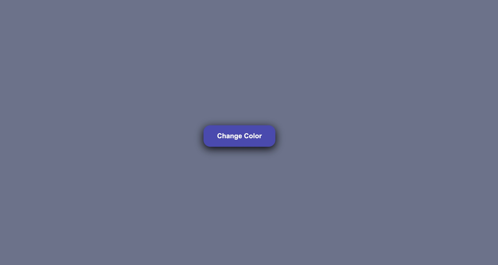

# 🎨 Color Picker --- Modern & Interactive UI

A sleek and interactive **Color Picker Application** that dynamically
changes the background color with smooth animations. Designed with
minimalism and modern UI/UX principles.

---

## ✨ Features

- 🎯 **Random Background Color** --- Changes with each button click\
- 🌈 **Animated Hover Effects** --- Button background transitions
  smoothly\
- ⚡ **Lightweight & Fast** --- Pure HTML, CSS, JavaScript\
- 💫 **Modern UI/UX** --- Clean and visually pleasing design

---

## 🛠️ Tech Stack

Technology Purpose

---

**HTML5** Page structure
**CSS3** Animations, transitions & hover effects
**JavaScript** Color logic & event handling

---

## 📁 Project Structure

    /color-picker
    │── index.html
    │── style.css
    │── script.js
    └── README.md

---

## 🧠 How It Works

- A JavaScript function generates random HEX/RGB colors\
- Clicking the button updates the page background\
- Hovering over the button triggers a CSS-based hover animation\
- Smooth transitions give the interface a modern feel

---

## 📸 Preview (Optional)

---

## 📜 License

This project is open-source. Feel free to use, customize, and improve
it.
