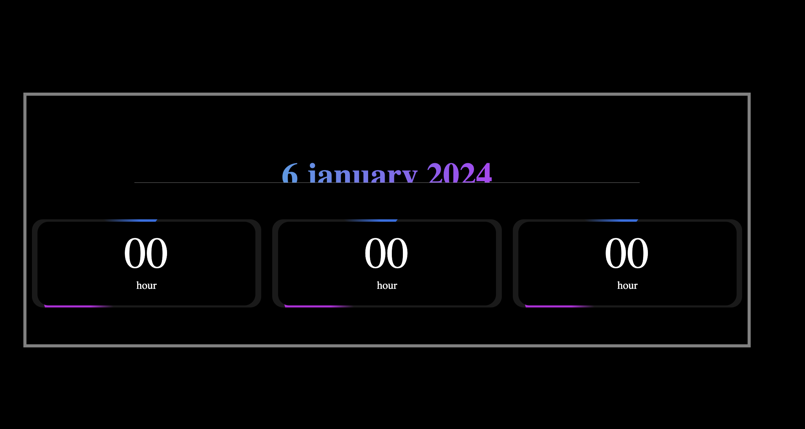

# ⏱️ Modern Timer — Clean & Animated UI

A minimal, elegant, and fully responsive **Timer Application** built using only **HTML and CSS**.  
This project focuses on clean design, smooth animations, and a modern user experience — all without JavaScript.

---

## ✨ Features

- ⏳ **Pure HTML + CSS Timer Layout** — No JavaScript required
- 🎞️ **Smooth Animations** — CSS transitions and keyframes
- 🖥️ **Modern & Minimal UI** — Clean typography and layout
- 📱 **Responsive Design** — Works on all screen sizes
- 🎨 **Customizable Styles** — Easy to modify colors & animation speed

---

## 🛠️ Tech Stack

| Technology | Purpose                                  |
| ---------- | ---------------------------------------- |
| **HTML5**  | Structure of the timer                   |
| **CSS3**   | Animations, layout, styling, transitions |

---

---

## 🧠 How It Works

- The timer interface (numbers, labels, circular indicators, etc.) is built entirely using HTML elements.
- **CSS keyframes animation** simulates counting, progress movement, or visual timer effects.
- Additional transitions are used for smooth style changes and hover effects.
- Because no JavaScript is used, the focus is purely on UI/UX animation and design.

---

## 📸 Preview (Optional)

_Add a screenshot, GIF, or animation here to showcase the Timer UI_

Example:

```md


---

## 📜 License

This project is open-source under the MIT License — feel free to customize and improve it.
```
