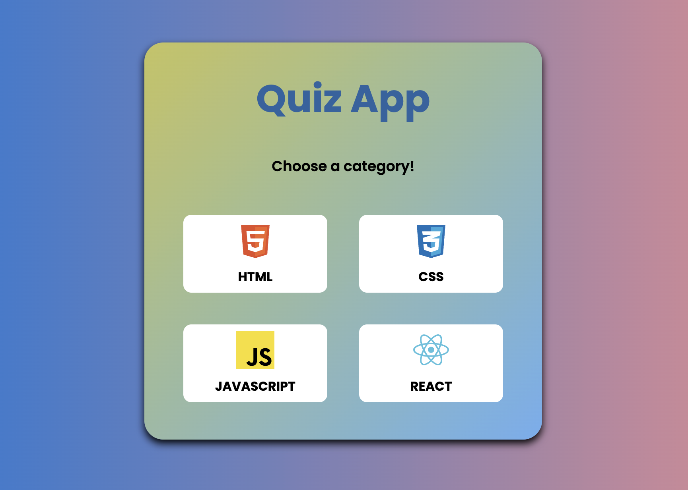
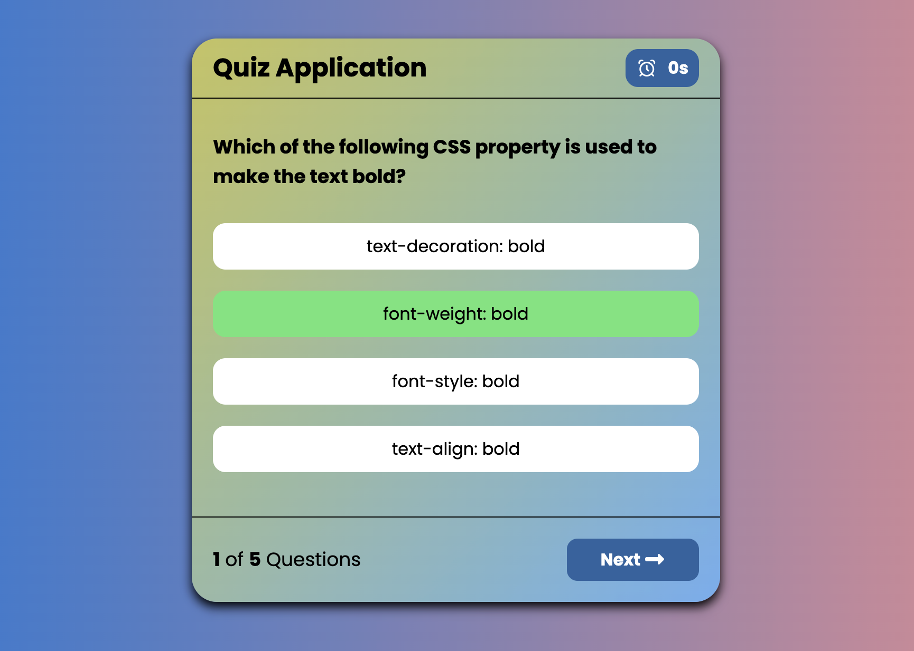

# 📝 Quiz App — Modern & Responsive UI

A modern, fully responsive **Quiz Application** built with **HTML, CSS, Tailwind, and JavaScript**.  
This app features **4 different categories** and provides interactive quizzes for each category with instant feedback.

---

## ✨ Features

- 🎯 **Four Categories** — Users can select from 4 different quiz categories
- 🧠 **Interactive Quizzes** — Multiple choice questions with instant validation
- 🎞️ **Smooth Animations** — Tailwind CSS for responsive design and transitions
- 🖥️ **Modern & Minimal UI** — Clean typography, layout, and responsive interface
- ⚡ **Easy to Customize** — Add new questions, categories, or styles effortlessly

---

## 🛠️ Tech Stack

| Technology          | Purpose                                            |
| ------------------- | -------------------------------------------------- |
| **HTML5**           | Structure of the quiz and categories               |
| **CSS3 & Tailwind** | Styling, layout, responsive design, and animations |
| **JavaScript**      | Quiz logic, scoring, and dynamic updates           |

---

---

## 🧠 How It Works

- Users select a category, which loads related quiz questions dynamically.
- JavaScript handles question display, answer validation, and score calculation.
- Tailwind CSS provides responsive layout and smooth UI transitions.
- The app works seamlessly on desktop, tablet, and mobile devices.

---

## 📸 Preview

  
  

---

## 📜 License

This project is open-source under the MIT License.  
Feel free to use, customize, and improve it for your own projects.
