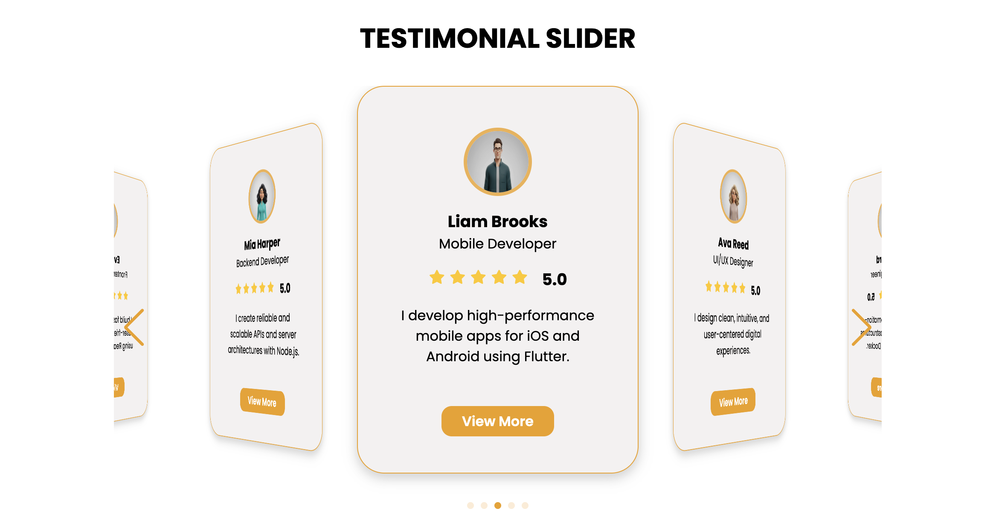

# 💬 Testimonial Slider — Modern & Responsive UI

A sleek, fully responsive **Testimonial Slider** built with **HTML, CSS, JavaScript, and Swiper.js**.  
This project focuses on modern design, smooth animations, and a great user experience across devices.

---

## ✨ Features

- 🌐 **Responsive Design** — Works perfectly on all screen sizes
- 🎞️ **Smooth Slider Animations** — Powered by Swiper.js
- 🖥️ **Modern & Minimal UI** — Clean typography and aesthetic layout
- 🔄 **Fully Functional Slider** — Autoplay, loop, navigation arrows, pagination
- ⚡ **Easy to Customize** — Update styles, content, or slider options easily

---

## 🛠️ Tech Stack

| Technology     | Purpose                                           |
| -------------- | ------------------------------------------------- |
| **HTML5**      | Structure of the slider                           |
| **CSS3**       | Styling, animations, transitions                  |
| **JavaScript** | Swiper initialization and slider logic            |
| **Swiper.js**  | Responsive and touch-enabled slider functionality |

---

---

## 🧠 How It Works

- Testimonials are structured using semantic HTML elements.
- **CSS animations** create smooth transitions and hover effects.
- **JavaScript & Swiper.js** initialize the slider with autoplay, loop, navigation arrows, and pagination.
- Fully responsive design ensures an excellent user experience across all devices.

---

## 📸 Preview

  

---

## 📜 License

This project is open-source under the MIT License.  
Feel free to use, customize, and improve it for your own projects.
