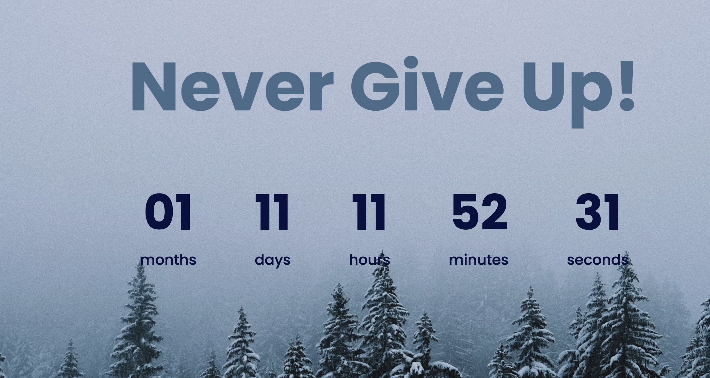

# ⏳ Countdown Timer — New Year Countdown

A modern, fully responsive **Countdown Timer** built with **HTML, CSS, and Vanilla JavaScript**.  
This timer counts down to New Year, showing the remaining **months, days, hours, minutes, and seconds** in a clean and animated interface.

---

## ✨ Features

- 🗓️ **Full Countdown** — Displays remaining months, days, hours, minutes, and seconds
- 🎞️ **Smooth Animations** — CSS transitions enhance the visual experience
- 🖥️ **Modern & Minimal UI** — Clean typography and layout
- 📱 **Responsive Design** — Works on all screen sizes
- ⚡ **Easy to Customize** — Change target date, styles, and layout easily

---

## 🛠️ Tech Stack

| Technology     | Purpose                             |
| -------------- | ----------------------------------- |
| **HTML5**      | Timer structure and content         |
| **CSS3**       | Styling, layout, and animations     |
| **JavaScript** | Countdown logic and dynamic updates |

---

---

## 🧠 How It Works

- JavaScript calculates the remaining time until **January 1st** of the upcoming year.
- Countdown is broken down into **months, days, hours, minutes, and seconds**.
- **CSS animations** enhance number changes and visual effects.
- Fully responsive design ensures the timer looks great on all devices.

---

## 📸 Preview

  

---

## 📜 License

This project is open-source under the MIT License.  
Feel free to use, customize, and improve it for your own projects.
