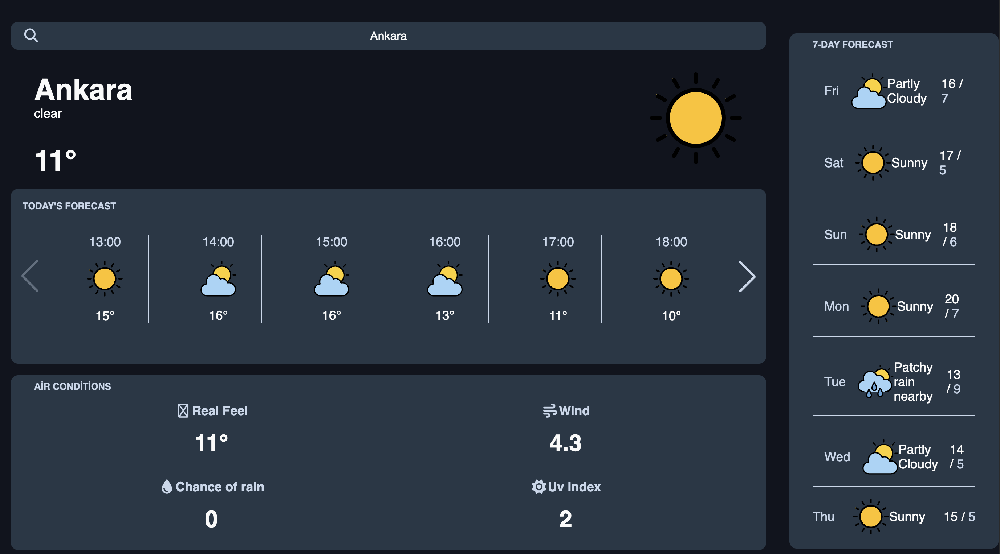

# 🌤️ Weather App — Modern & Responsive UI

A modern, fully responsive **Weather Application** built with **HTML, CSS, JavaScript, API, and Swiper.js**.  
This app provides **current, hourly, and 7-day weather forecasts** along with detailed metrics for real feel temperature, wind speed, UV index, and precipitation probability.

---

## ✨ Features

- 🌐 **Current Weather** — Shows temperature, humidity, wind, UV index, and precipitation probability
- 📊 **Hourly Forecast** — Hour-by-hour weather data with animations
- 📅 **7-Day Forecast** — Visual daily weather reports for the upcoming week
- 🎞️ **Smooth Slider Animations** — Powered by Swiper.js for easy navigation between hours/days
- 🖥️ **Modern & Minimal UI** — Clean, responsive, and visually appealing layout
- ⚡ **Easy to Customize** — Change API endpoints, styles, or layout effortlessly

---

## 🛠️ Tech Stack

| Technology      | Purpose                                                          |
| --------------- | ---------------------------------------------------------------- |
| **HTML5**       | Structure and content                                            |
| **CSS3**        | Styling, animations, transitions                                 |
| **JavaScript**  | API requests, data processing, dynamic updates                   |
| **Swiper.js**   | Responsive and touch-enabled slider for hourly & daily forecasts |
| **Weather API** | Provides real-time weather data                                  |

---

---

## 🧠 How It Works

- The app fetches weather data from an external **API**.
- JavaScript processes the data and updates the UI dynamically.
- Swiper.js provides smooth, responsive sliding for hourly and daily forecasts.
- Displays detailed metrics: **real feel temperature, wind speed, UV index, and precipitation probability**.
- Fully responsive design ensures optimal experience on mobile, tablet, and desktop devices.

---

## 📸 Preview

  

---

## 📜 License

This project is open-source under the MIT License.  
Feel free to use, customize, and improve it for your own projects.
